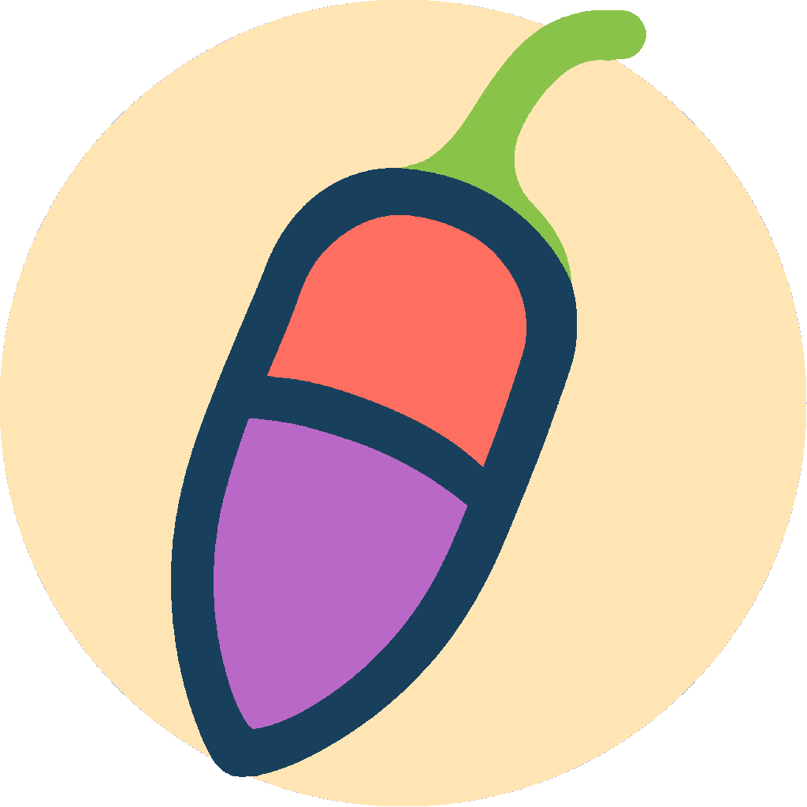

# Capsules

<p align="center">
  
</p>

Capsules lets you run applications in secure, isolated containers while maintaining full graphical capabilities. Built on Podman's rootless container technology and Xpra's seamless X11 integration, it provides a secure sandbox environment with native desktop interaction.

## 🎯 What It Does

### Secure Application Sandboxing
Run applications in isolated containers without sacrificing usability. Xpra provides seamless X11 forwarding, letting you interact with containerized applications as if they were running natively.

### Template-Based Architecture
Templates serve as efficient, read-only base images for your containers:
- Create a template with your desired base system and applications
- Spawn multiple capsules from a single template
- Changes to templates automatically propagate to derived capsules
- Capsules maintain isolation - changes in capsules don't affect the template
- Save disk space through efficient filesystem sharing

## ✨ Key Features

### 🛡️ Security First
- **Rootless Containers**: Powered by Podman for isolation without root privileges
- **Secure GUI**: Isolated X11 applications through Xpra integration

### 🎮 Easy to Use
- **Template System**: Create reusable container templates
- **GUI Management**: Full graphical interface for container management
- **Port Mapping**: Simple host-to-container port forwarding

### 🔧 Flexible Configuration
- **Custom Commands**: Execute commands in containers
- **Persistent Storage**: Overlay filesystem for container persistence

## 🚀 Getting Started

### Prerequisites

#### Required Software
- podman (container runtime)
- xpra (≥ v6.0) for secure GUI forwarding
- python3 and Qt6
- python-pyqt6

### System Configuration

#### Setting up xpra
1. Verify your xpra version:
   ```bash
   xpra --version
   ```
2. Must be version 6.0 or higher
3. Need an update? Visit the [xpra download page](https://github.com/Xpra-org/xpra/wiki/Download)

#### Configuring podman
1. Ensure rootless mode is enabled:
   ```bash
   podman info --format '{{.Host.Security.Rootless}}'
   ```
This should return `true`

## 🚀 Installation & Running


### Clone the Repository
```bash
git clone https://github.com/yourusername/capsules.git
cd capsules
```

### Install Dependencies
On Debian/Ubuntu:
```bash
# Add repository for xpra 6.*
wget -qO - https://xpra.org/gpg.asc | sudo gpg --dearmor -o /etc/apt/trusted.gpg.d/xpra-archive.gpg
echo "deb https://xpra.org/ $(lsb_release -c | awk '{print $2}') main" | sudo tee /etc/apt/sources.list.d/xpra-$(lsb_release -c | awk '{print $2}').list

sudo apt update
sudo apt install podman xpra python3-pyqt6
```

On Arch Linux:
```bash
sudo pacman -S podman xpra python-pyqt6
```

### Run the Application
Make the script executable:
```bash
chmod +x capsules.py
```

Launch Capsules:
```bash
./capsules.py
```

Or run with Python directly:
```bash
python3 capsules.py
```

## 📜 License

This project is licensed under the GNU General Public License v3.0.  
See the [LICENSE](./LICENSE) file for details.